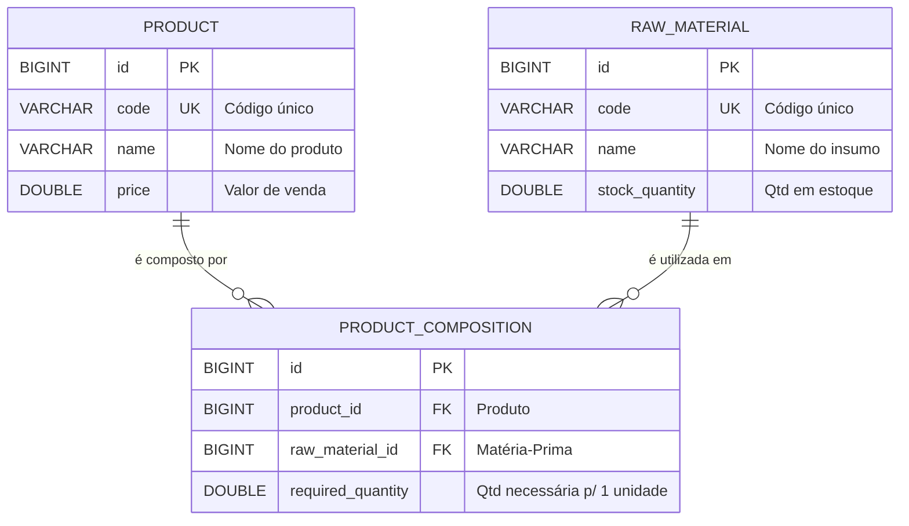

# 🏭 Backend — Gestão Industrial (API REST)

API REST para gerenciamento de insumos e otimização de produção industrial, desenvolvida com **Spring Boot 4**, **Java 21**, **H2 Database** e **Spring Security**.

---

## 📑 Sumário

- [Visão Geral](#-visão-geral)
- [Tecnologias & Dependências](#-tecnologias--dependências)
- [Pré-requisitos](#-pré-requisitos)
- [Como Rodar](#-como-rodar)
- [Configuração](#-configuração)
- [Estrutura do Projeto](#-estrutura-do-projeto)
- [Diagrama de Classes (Mermaid)](#-diagrama-de-classes)
- [Endpoints da API](#-endpoints-da-api)
- [Banco de Dados (H2)](#-banco-de-dados-h2)
- [Testes](#-testes)
- [Padrões & Boas Práticas](#-padrões--boas-práticas)

---

## 🔍 Visão Geral

O backend é responsável por:

1. **CRUD de Matérias-Primas (Raw Materials)** — cadastro, edição, listagem e remoção de insumos com controle de estoque.
2. **CRUD de Produtos (Products)** — cadastro, edição, listagem e remoção de produtos, incluindo a composição (quais matérias-primas e quantidades são necessárias para fabricar 1 unidade).
3. **Cálculo de Otimização de Produção** — algoritmo que analisa o estoque atual de matérias-primas e sugere **quais produtos fabricar e em que quantidade** para obter o **maior valor total de venda**, resolvendo conflitos quando dois ou mais produtos disputam a mesma matéria-prima.
4. **Segurança** — camada de autenticação/autorização via Spring Security.

---

## 🛠 Tecnologias & Dependências

| Tecnologia | Versão | Finalidade |
|---|---|---|
| **Java** | 21 | Linguagem principal |
| **Spring Boot** | 4.0.3 | Framework backend |
| **Spring Data JPA** | — | Persistência e ORM (Hibernate) |
| **Spring Security** | — | Autenticação e autorização |
| **Spring Web MVC** | — | Exposição de endpoints REST |
| **H2 Database** | runtime | Banco relacional embarcado |
| **Lombok** | — | Redução de boilerplate (getters, setters, builders) |
| **Spring Boot DevTools** | runtime | Hot-reload em desenvolvimento |
| **JUnit 5 + Spring Test** | test | Testes unitários e de integração |

---

## 📋 Pré-requisitos

- **Java 21** (JDK) — [Download](https://adoptium.net/)
- **Maven 3.9+** (ou use o Maven Wrapper incluso: `mvnw` / `mvnw.cmd`)
- **Git**

> ⚠️ Não é necessário instalar banco de dados. O H2 roda em modo embarcado automaticamente.

---

## 🚀 Como Rodar

### 1. Clonar o repositório

```bash
git clone https://github.com/seu-usuario/teste_pratico_full_stack_PeD.git
cd teste_pratico_full_stack_PeD/backend
```

### 2. Compilar e executar

**Windows (PowerShell):**
```powershell
.\mvnw.cmd spring-boot:run
```

**Linux / macOS:**
```bash
./mvnw spring-boot:run
```

### 3. Acessar

| Recurso | URL |
|---|---|
| API REST | `http://localhost:8080/api/` |
| Console H2 | `http://localhost:8080/h2-console` |

---

## ⚙ Configuração

Arquivo: `src/main/resources/application.properties`

```properties
spring.application.name=backend

# ── Datasource (H2 embarcado) ──────────────────────────
spring.datasource.url=jdbc:h2:mem:factory_db
spring.datasource.driver-class-name=org.h2.Driver
spring.datasource.username=sa
spring.datasource.password=

# ── JPA / Hibernate ────────────────────────────────────
spring.jpa.database-platform=org.hibernate.dialect.H2Dialect
spring.jpa.hibernate.ddl-auto=update
spring.jpa.show-sql=true

# ── H2 Console ─────────────────────────────────────────
spring.h2.console.enabled=true
spring.h2.console.path=/h2-console

# ── Server ──────────────────────────────────────────────
server.port=8080
```

---

## 📂 Estrutura do Projeto

A organização segue o padrão de camadas (Layered Architecture):

```
backend/
├── src/
│   ├── main/
│   │   ├── java/com/example/backend/
│   │   │   ├── BackendApplication.java            # Classe principal (entry point)
│   │   │   │
│   │   │   ├── config/                            # Configurações (Security, CORS, etc.)
│   │   │   │   └── SecurityConfig.java
│   │   │   │
│   │   │   ├── entity/                            # Entidades JPA (modelos de domínio)
│   │   │   │   ├── RawMaterial.java               # Matéria-Prima
│   │   │   │   ├── Product.java                   # Produto
│   │   │   │   └── ProductComposition.java        # Composição (Produto ↔ Matéria-Prima)
│   │   │   │
│   │   │   ├── repository/                        # Repositórios Spring Data JPA
│   │   │   │   ├── RawMaterialRepository.java
│   │   │   │   ├── ProductRepository.java
│   │   │   │   └── ProductCompositionRepository.java
│   │   │   │
│   │   │   ├── service/                           # Lógica de negócio
│   │   │   │   ├── RawMaterialService.java
│   │   │   │   ├── ProductService.java
│   │   │   │   └── ProductionOptimizerService.java  # ⭐ Algoritmo de otimização
│   │   │   │
│   │   │   ├── controller/                        # Endpoints REST
│   │   │   │   ├── RawMaterialController.java
│   │   │   │   ├── ProductController.java
│   │   │   │   └── ProductionController.java
│   │   │   │
│   │   │   ├── dto/                               # Data Transfer Objects
│   │   │   │   ├── RawMaterialDTO.java
│   │   │   │   ├── ProductDTO.java
│   │   │   │   ├── ProductCompositionDTO.java
│   │   │   │   └── ProductionSuggestionDTO.java
│   │   │   │
│   │   │   └── exception/                         # Tratamento de exceções
│   │   │       ├── ResourceNotFoundException.java
│   │   │       └── GlobalExceptionHandler.java
│   │   │
│   │   └── resources/
│   │       ├── application.properties             # Configurações da aplicação
│   │       ├── static/                            # Arquivos estáticos (se necessário)
│   │       └── templates/                         # Templates (se necessário)
│   │
│   └── test/
│       └── java/com/example/backend/
│           ├── BackendApplicationTests.java       # Teste de contexto
│           ├── service/
│           │   └── ProductionOptimizerServiceTest.java  # ⭐ Testes do algoritmo
│           └── controller/
│               ├── RawMaterialControllerTest.java
│               └── ProductControllerTest.java
│
├── pom.xml                                        # Dependências Maven
├── mvnw / mvnw.cmd                                # Maven Wrapper
└── README.md                                      # Este arquivo
```

---

## 📊 Diagrama de Classes

```mermaid
classDiagram
    direction LR

    class BackendApplication {
        +main(String[] args) void
    }

    namespace Entity {
        class RawMaterial {
            -Long id
            -String code
            -String name
            -Double stockQuantity
            +getId() Long
            +getCode() String
            +getName() String
            +getStockQuantity() Double
            +setId(Long id) void
            +setCode(String code) void
            +setName(String name) void
            +setStockQuantity(Double quantity) void
        }

        class Product {
            -Long id
            -String code
            -String name
            -Double price
            -List~ProductComposition~ compositions
            +getId() Long
            +getCode() String
            +getName() String
            +getPrice() Double
            +getCompositions() List~ProductComposition~
            +setId(Long id) void
            +setCode(String code) void
            +setName(String name) void
            +setPrice(Double price) void
            +setCompositions(List compositions) void
        }

        class ProductComposition {
            -Long id
            -Product product
            -RawMaterial rawMaterial
            -Double requiredQuantity
            +getId() Long
            +getProduct() Product
            +getRawMaterial() RawMaterial
            +getRequiredQuantity() Double
            +setId(Long id) void
            +setProduct(Product product) void
            +setRawMaterial(RawMaterial rawMaterial) void
            +setRequiredQuantity(Double quantity) void
        }
    }

    namespace Repository {
        class RawMaterialRepository {
            <<interface>>
            +findByCode(String code) Optional~RawMaterial~
            +existsByCode(String code) boolean
        }

        class ProductRepository {
            <<interface>>
            +findByCode(String code) Optional~Product~
            +existsByCode(String code) boolean
        }

        class ProductCompositionRepository {
            <<interface>>
            +findByProductId(Long productId) List~ProductComposition~
            +deleteByProductId(Long productId) void
        }
    }

    namespace Service {
        class RawMaterialService {
            -RawMaterialRepository repository
            +findAll() List~RawMaterial~
            +findById(Long id) RawMaterial
            +create(RawMaterialDTO dto) RawMaterial
            +update(Long id, RawMaterialDTO dto) RawMaterial
            +delete(Long id) void
        }

        class ProductService {
            -ProductRepository repository
            -ProductCompositionRepository compositionRepository
            +findAll() List~Product~
            +findById(Long id) Product
            +create(ProductDTO dto) Product
            +update(Long id, ProductDTO dto) Product
            +delete(Long id) void
        }

        class ProductionOptimizerService {
            -ProductRepository productRepository
            -RawMaterialRepository rawMaterialRepository
            +optimize() List~ProductionSuggestionDTO~
            -calculateMaxUnits(Product product, Map stockMap) int
            -consumeStock(Product product, int units, Map stockMap) void
        }
    }

    namespace Controller {
        class RawMaterialController {
            -RawMaterialService service
            +getAll() ResponseEntity
            +getById(Long id) ResponseEntity
            +create(RawMaterialDTO dto) ResponseEntity
            +update(Long id, RawMaterialDTO dto) ResponseEntity
            +delete(Long id) ResponseEntity
        }

        class ProductController {
            -ProductService service
            +getAll() ResponseEntity
            +getById(Long id) ResponseEntity
            +create(ProductDTO dto) ResponseEntity
            +update(Long id, ProductDTO dto) ResponseEntity
            +delete(Long id) ResponseEntity
        }

        class ProductionController {
            -ProductionOptimizerService service
            +optimize() ResponseEntity
        }
    }

    namespace DTO {
        class RawMaterialDTO {
            -String code
            -String name
            -Double stockQuantity
        }

        class ProductDTO {
            -String code
            -String name
            -Double price
            -List~ProductCompositionDTO~ compositions
        }

        class ProductCompositionDTO {
            -Long rawMaterialId
            -Double requiredQuantity
        }

        class ProductionSuggestionDTO {
            -String productCode
            -String productName
            -int quantity
            -Double unitPrice
            -Double totalValue
        }
    }

    namespace Config {
        class SecurityConfig {
            +securityFilterChain(HttpSecurity http) SecurityFilterChain
        }
    }

    namespace Exception {
        class ResourceNotFoundException {
            -String message
            +ResourceNotFoundException(String msg)
        }

        class GlobalExceptionHandler {
            +handleNotFound(ResourceNotFoundException ex) ResponseEntity
            +handleGeneral(Exception ex) ResponseEntity
        }
    }

    %% ── Relacionamentos entre Entidades ──
    Product "1" --> "*" ProductComposition : compositions
    ProductComposition "*" --> "1" RawMaterial : rawMaterial
    ProductComposition "*" --> "1" Product : product

    %% ── Repository → Entity ──
    RawMaterialRepository ..> RawMaterial : manages
    ProductRepository ..> Product : manages
    ProductCompositionRepository ..> ProductComposition : manages

    %% ── Service → Repository ──
    RawMaterialService --> RawMaterialRepository : uses
    ProductService --> ProductRepository : uses
    ProductService --> ProductCompositionRepository : uses
    ProductionOptimizerService --> ProductRepository : uses
    ProductionOptimizerService --> RawMaterialRepository : uses

    %% ── Controller → Service ──
    RawMaterialController --> RawMaterialService : uses
    ProductController --> ProductService : uses
    ProductionController --> ProductionOptimizerService : uses

    %% ── Controller → DTO ──
    RawMaterialController ..> RawMaterialDTO : receives/returns
    ProductController ..> ProductDTO : receives/returns
    ProductController ..> ProductCompositionDTO : receives
    ProductionController ..> ProductionSuggestionDTO : returns

    %% ── Service → DTO ──
    ProductionOptimizerService ..> ProductionSuggestionDTO : produces
```



### Diagrama ER (Entidade-Relacionamento)



---

## 🔗 Endpoints da API

### Matéria-Prima (`/api/raw-materials`)

| Método | Endpoint | Descrição |
|---|---|---|
| `GET` | `/api/raw-materials` | Listar todas as matérias-primas |
| `GET` | `/api/raw-materials/{id}` | Buscar por ID |
| `POST` | `/api/raw-materials` | Cadastrar nova matéria-prima |
| `PUT` | `/api/raw-materials/{id}` | Atualizar matéria-prima |
| `DELETE` | `/api/raw-materials/{id}` | Remover matéria-prima |

**Exemplo de body (POST/PUT):**
```json
{
  "code": "MP001",
  "name": "Flour",
  "stockQuantity": 500.0
}
```

---

### Produto (`/api/products`)

| Método | Endpoint | Descrição |
|---|---|---|
| `GET` | `/api/products` | Listar todos os produtos |
| `GET` | `/api/products/{id}` | Buscar por ID |
| `POST` | `/api/products` | Cadastrar novo produto (com composição) |
| `PUT` | `/api/products/{id}` | Atualizar produto |
| `DELETE` | `/api/products/{id}` | Remover produto |

**Exemplo de body (POST/PUT):**
```json
{
  "code": "PRD001",
  "name": "Bread",
  "price": 12.50,
  "compositions": [
    { "rawMaterialId": 1, "requiredQuantity": 200.0 },
    { "rawMaterialId": 2, "requiredQuantity": 50.0 }
  ]
}
```

---

### Otimização de Produção (`/api/production`)

| Método | Endpoint | Descrição |
|---|---|---|
| `GET` | `/api/production/optimize` | Calcular sugestão ótima de produção |

**Exemplo de resposta:**
```json
[
  {
    "productCode": "PRD001",
    "productName": "Bread",
    "quantity": 5,
    "unitPrice": 12.50,
    "totalValue": 62.50
  },
  {
    "productCode": "PRD003",
    "productName": "Cake",
    "quantity": 2,
    "unitPrice": 35.00,
    "totalValue": 70.00
  }
]
```

> 💡 O campo `totalValue` = `quantity × unitPrice`. A soma de todos os `totalValue` é o **valor máximo de venda** que a fábrica pode atingir com o estoque atual.

---

## 🗄 Banco de Dados (H2)

O projeto utiliza **H2 Database** em modo embarcado (em memória). Não é necessário instalar nenhum banco externo.

### Acessar o Console H2

1. Inicie a aplicação
2. Acesse: `http://localhost:8080/h2-console`
3. Preencha:
   - **JDBC URL:** `jdbc:h2:mem:factory_db`
   - **User:** `sa`
   - **Password:** *(vazio)*
4. Clique em **Connect**

### Tabelas criadas automaticamente

| Tabela | Descrição |
|---|---|
| `raw_material` | Matérias-primas / Insumos |
| `product` | Produtos |
| `product_composition` | Relação Produto ↔ Matéria-Prima (N:N com atributo `required_quantity`) |

---

## 🧪 Testes

### Executar todos os testes

```powershell
.\mvnw.cmd test
```

### Cobertura de testes esperada

| Camada | O que testar | Prioridade |
|---|---|---|
| `ProductionOptimizerService` | Algoritmo de otimização — cenários de estoque suficiente, conflito de insumos, estoque vazio, produto sem composição | ⭐ Obrigatório |
| `RawMaterialService` | CRUD — criar, atualizar, buscar, deletar | Recomendado |
| `ProductService` | CRUD — criar com composição, atualizar, deletar em cascata | Recomendado |
| `Controllers` | Endpoints REST — status codes, validação de input | Diferencial |

### Cenários de teste do algoritmo de otimização

```
✅ Estoque suficiente para todos os produtos → deve maximizar valor total
✅ Dois produtos disputam a mesma matéria-prima → deve priorizar o de maior valor
✅ Estoque insuficiente para qualquer produto → deve retornar lista vazia
✅ Estoque zerado → deve retornar lista vazia
✅ Apenas 1 produto possível → deve produzir o máximo possível dele
✅ Múltiplas matérias-primas como gargalo → deve balancear produção corretamente
```

---

## 📐 Padrões & Boas Práticas

| Prática | Descrição |
|---|---|
| **Clean Code** | Nomes de variáveis, métodos e classes em **inglês**, descritivos e concisos |
| **Layered Architecture** | Separação clara: `Controller → Service → Repository → Entity` |
| **DTOs** | Objetos de transferência evitam expor entidades JPA diretamente na API |
| **Exception Handling** | `GlobalExceptionHandler` com `@ControllerAdvice` para respostas de erro padronizadas |
| **Lombok** | `@Getter`, `@Setter`, `@NoArgsConstructor`, `@AllArgsConstructor`, `@Builder` para reduzir boilerplate |
| **RESTful** | Verbos HTTP corretos (GET, POST, PUT, DELETE) e status codes adequados (200, 201, 204, 404, 400) |
| **Spring Security** | Configuração para proteger endpoints e permitir CORS com o frontend Vue.js |

---

## 📄 Licença

Este projeto faz parte de um teste prático para o time de P&D.

