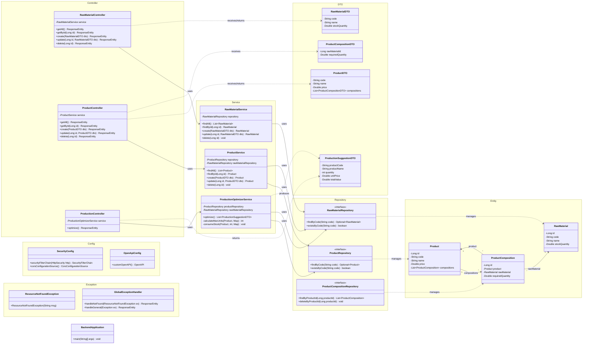
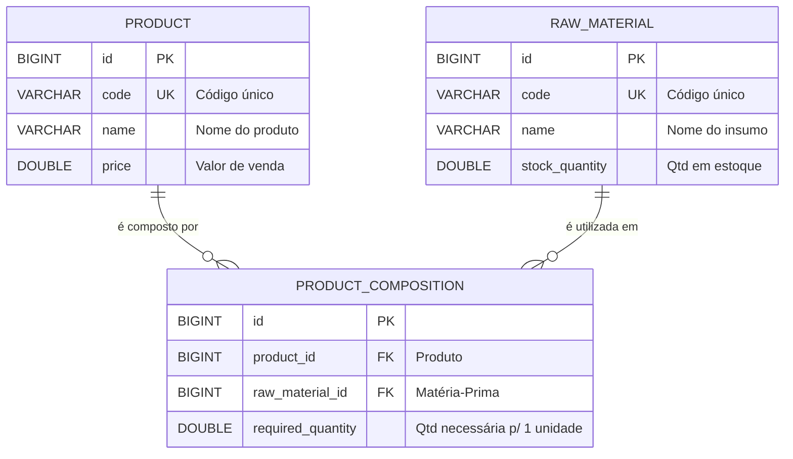

# 🏭 Backend — Gestão Industrial (API REST)

API REST para gerenciamento de insumos e otimização de produção industrial, desenvolvida com **Spring Boot 4**, **Java 21**, **H2 Database**, **Spring Security**, **Swagger/OpenAPI 3** e **Docker**.

---

## 📑 Sumário

- [Visão Geral](#-visão-geral)
- [Tecnologias & Dependências](#-tecnologias--dependências)
- [Pré-requisitos](#-pré-requisitos)
- [Como Rodar](#-como-rodar)
- [Docker](#-docker)
- [Configuração](#-configuração)
- [Swagger / OpenAPI](#-swagger--openapi)
- [Estrutura do Projeto](#-estrutura-do-projeto)
- [Diagrama de Classes (Mermaid)](#-diagrama-de-classes)
- [Endpoints da API](#-endpoints-da-api)
- [Banco de Dados (H2)](#-banco-de-dados-h2)
- [Testes](#-testes)
- [Padrões & Boas Práticas](#-padrões--boas-práticas)

---

## 🔍 Visão Geral

O backend é responsável por:

1. **CRUD de Matérias-Primas (Raw Materials)** — cadastro, edição, listagem e remoção de insumos com controle de estoque.
2. **CRUD de Produtos (Products)** — cadastro, edição, listagem e remoção de produtos, incluindo a composição (quais matérias-primas e quantidades são necessárias para fabricar 1 unidade).
3. **Cálculo de Otimização de Produção** — algoritmo guloso (Greedy) que analisa o estoque atual de matérias-primas e sugere **quais produtos fabricar e em que quantidade** para obter o **maior valor total de venda**, resolvendo conflitos quando dois ou mais produtos disputam a mesma matéria-prima.
4. **Segurança** — camada de autenticação/autorização via Spring Security (CORS habilitado, CSRF desabilitado para API REST).
5. **Documentação interativa** — Swagger UI com OpenAPI 3 para explorar e testar todos os endpoints diretamente pelo navegador.
6. **Containerização** — Dockerfile multi-stage e Docker Compose para execução isolada e reprodutível com um único comando.

---

## 🛠 Tecnologias & Dependências

| Tecnologia | Versão | Finalidade |
|---|---|---|
| **Java** | 21 | Linguagem principal |
| **Spring Boot** | 4.0.3 | Framework backend |
| **Spring Data JPA** | — | Persistência e ORM (Hibernate) |
| **Spring Security** | — | Autenticação, autorização e CORS |
| **Spring Web MVC** | — | Exposição de endpoints REST |
| **SpringDoc OpenAPI** | 2.8.6 | Documentação Swagger UI / OpenAPI 3 |
| **H2 Database** | runtime | Banco relacional embarcado (em memória) |
| **Lombok** | — | Redução de boilerplate (getters, setters, builders) |
| **Spring Boot DevTools** | runtime | Hot-reload em desenvolvimento |
| **Docker** | — | Containerização da aplicação (multi-stage build) |
| **Docker Compose** | — | Orquestração de containers |
| **JUnit 5 + Mockito** | test | Testes unitários e de integração |

---

## 📋 Pré-requisitos

### Execução com Docker (recomendado) ✅

Apenas:
- **Docker** — [Download](https://docs.docker.com/get-docker/)
- **Docker Compose** — incluído no Docker Desktop

> 💡 Não é necessário instalar Java, Maven ou banco de dados.

### Execução local (sem Docker)

- **Java 21** (JDK) — [Download](https://adoptium.net/)
- **Maven 3.9+** — ou use o Maven Wrapper incluso (`mvnw` / `mvnw.cmd`)
- **Git**

> ⚠️ Não é necessário instalar banco de dados. O H2 roda em modo embarcado automaticamente.

---

## 🚀 Como Rodar

### Opção 1 — Docker Compose (recomendado) 🐳

Um único comando constrói e executa tudo:

```bash
docker compose up --build
```

> Para rodar em background (modo detach):
```bash
docker compose up --build -d
```

Pronto! Acesse:

| Recurso | URL |
|---|---|
| Swagger UI | [http://localhost:8080/swagger-ui.html](http://localhost:8080/swagger-ui.html) |
| API REST | [http://localhost:8080/api/](http://localhost:8080/api/) |
| Console H2 | [http://localhost:8080/h2-console](http://localhost:8080/h2-console) |
| API Docs (JSON) | [http://localhost:8080/api-docs](http://localhost:8080/api-docs) |

### Opção 2 — Execução Local (Maven)

#### 1. Clonar o repositório

```bash
git clone https://github.com/seu-usuario/teste_pratico_full_stack_PeD.git
cd teste_pratico_full_stack_PeD/backend
```

#### 2. Compilar e executar

**Windows (PowerShell):**
```powershell
.\mvnw.cmd spring-boot:run
```

**Linux / macOS:**
```bash
./mvnw spring-boot:run
```

#### 3. Acessar

| Recurso | URL |
|---|---|
| Swagger UI | [http://localhost:8080/swagger-ui.html](http://localhost:8080/swagger-ui.html) |
| API REST | [http://localhost:8080/api/](http://localhost:8080/api/) |
| Console H2 | [http://localhost:8080/h2-console](http://localhost:8080/h2-console) |

---

## 🐳 Docker

O projeto inclui suporte completo a Docker com **multi-stage build** para otimização do tamanho da imagem.

### Dockerfile (Multi-stage)

| Stage | Imagem Base | Finalidade |
|---|---|---|
| **Build** | `eclipse-temurin:21-jdk` | Compilação do projeto com Maven Wrapper |
| **Runtime** | `eclipse-temurin:21-jre` | Execução da aplicação (imagem final leve) |

Características:
- **Multi-stage build** — imagem final contém apenas o JRE + JAR (sem JDK, sem código-fonte)
- **HEALTHCHECK** embutido no Dockerfile — verifica `/api-docs` a cada 30s
- `curl` instalado na imagem runtime para healthcheck funcional

### Docker Compose

O `docker-compose.yml` configura:

- **Container:** `gestao-industrial-backend`
- **Porta:** `8080:8080`
- **Restart policy:** `unless-stopped` — reinicia automaticamente em caso de falha
- **Health check:** verifica o endpoint `/api-docs` a cada 30s (start period: 60s)
- **Variáveis de ambiente:** datasource H2, JPA, H2 Console habilitado com acesso externo

> ⚠️ Ao utilizar Docker, o H2 Console está habilitado com `SPRING_H2_CONSOLE_SETTINGS_WEB_ALLOW_OTHERS=true` para permitir acesso externo ao container.

### Comandos úteis

```bash
# Build e execução (foreground)
docker compose up --build

# Build e execução (background)
docker compose up --build -d

# Ver logs em tempo real
docker compose logs -f backend

# Parar containers
docker compose down

# Rebuild sem cache
docker compose build --no-cache

# Executar testes dentro do container
docker compose run --rm backend ./mvnw test
```

### Build e execução manual (sem Docker Compose)

```bash
# Build da imagem
docker build -t gestao-industrial-backend .

# Executar o container
docker run -p 8080:8080 --name gestao-industrial-backend gestao-industrial-backend
```

---

## ⚙ Configuração

Arquivo: `src/main/resources/application.properties`

```properties
spring.application.name=backend

# ── Datasource (H2 embarcado) ──────────────────────────
spring.datasource.url=jdbc:h2:mem:factory_db
spring.datasource.driver-class-name=org.h2.Driver
spring.datasource.username=sa
spring.datasource.password=

# ── JPA / Hibernate ────────────────────────────────────
spring.jpa.database-platform=org.hibernate.dialect.H2Dialect
spring.jpa.hibernate.ddl-auto=update
spring.jpa.show-sql=true

# ── H2 Console ─────────────────────────────────────────
spring.h2.console.enabled=true
spring.h2.console.path=/h2-console

# ── Swagger / OpenAPI ──────────────────────────────────
springdoc.api-docs.path=/api-docs
springdoc.swagger-ui.path=/swagger-ui.html
springdoc.swagger-ui.operationsSorter=method
springdoc.swagger-ui.tagsSorter=alpha
springdoc.swagger-ui.tryItOutEnabled=true

# ── Server ──────────────────────────────────────────────
server.port=8080
```

---

## 📖 Swagger / OpenAPI

O projeto utiliza **SpringDoc OpenAPI** (`springdoc-openapi-starter-webmvc-ui` v2.8.6) para gerar automaticamente a documentação interativa da API.

### Acessar o Swagger UI

1. Inicie a aplicação (local ou via Docker)
2. Acesse: **[http://localhost:8080/swagger-ui.html](http://localhost:8080/swagger-ui.html)**

### Recursos disponíveis

| Recurso | URL | Descrição |
|---|---|---|
| **Swagger UI** | `/swagger-ui.html` | Interface interativa para explorar e testar endpoints |
| **OpenAPI JSON** | `/api-docs` | Especificação OpenAPI 3 em formato JSON |

### Funcionalidades do Swagger UI

- ✅ **Try It Out** habilitado por padrão — teste requisições diretamente pelo navegador
- ✅ Endpoints organizados por **tags** (ordem alfabética): Matérias-Primas, Otimização de Produção, Produtos
- ✅ Métodos ordenados por **tipo HTTP** (GET, POST, PUT, DELETE)
- ✅ Schemas dos DTOs gerados automaticamente
- ✅ Exemplos de request/response em cada endpoint
- ✅ Documentação detalhada com regras de negócio por endpoint

### Configuração personalizada

A classe `OpenApiConfig.java` define os metadados da API (título, versão, descrição, contato, licença e servidores).

---

## 📂 Estrutura do Projeto

A organização segue o padrão de camadas (Layered Architecture):

```
backend/
├── src/
│   ├── main/
│   │   ├── java/com/example/backend/
│   │   │   ├── BackendApplication.java                # Classe principal (entry point)
│   │   │   │
│   │   │   ├── config/                                # Configurações
│   │   │   │   ├── SecurityConfig.java                # Security, CORS, H2 Console, Swagger
│   │   │   │   └── OpenApiConfig.java                 # Swagger / OpenAPI 3 metadata
│   │   │   │
│   │   │   ├── entity/                                # Entidades JPA (modelos de domínio)
│   │   │   │   ├── RawMaterial.java                   # Matéria-Prima
│   │   │   │   ├── Product.java                       # Produto
│   │   │   │   └── ProductComposition.java            # Composição (Produto ↔ Matéria-Prima)
│   │   │   │
│   │   │   ├── repository/                            # Repositórios Spring Data JPA
│   │   │   │   ├── RawMaterialRepository.java
│   │   │   │   ├── ProductRepository.java
│   │   │   │   └── ProductCompositionRepository.java
│   │   │   │
│   │   │   ├── service/                               # Lógica de negócio
│   │   │   │   ├── RawMaterialService.java
│   │   │   │   ├── ProductService.java
│   │   │   │   └── ProductionOptimizerService.java    # ⭐ Algoritmo de otimização
│   │   │   │
│   │   │   ├── controller/                            # Endpoints REST
│   │   │   │   ├── RawMaterialController.java
│   │   │   │   ├── ProductController.java
│   │   │   │   └── ProductionController.java
│   │   │   │
│   │   │   ├── dto/                                   # Data Transfer Objects
│   │   │   │   ├── RawMaterialDTO.java
│   │   │   │   ├── ProductDTO.java
│   │   │   │   ├── ProductCompositionDTO.java
│   │   │   │   └── ProductionSuggestionDTO.java
│   │   │   │
│   │   │   └── exception/                             # Tratamento de exceções
│   │   │       ├── ResourceNotFoundException.java
│   │   │       └── GlobalExceptionHandler.java
│   │   │
│   │   └── resources/
│   │       ├── application.properties                 # Configurações da aplicação
│   │       ├── static/
│   │       └── templates/
│   │
│   └── test/
│       └── java/com/example/backend/
│           ├── BackendApplicationTests.java           # Teste de contexto
│           ├── service/
│           │   ├── RawMaterialServiceTest.java        # 10 testes — CRUD completo
│           │   ├── ProductServiceTest.java            # 14 testes — CRUD + composições
│           │   └── ProductionOptimizerServiceTest.java # 15 testes — ⭐ Algoritmo
│           ├── controller/
│           │   ├── RawMaterialControllerTest.java     # 9 testes — endpoints + status codes
│           │   ├── ProductControllerTest.java         # 11 testes — endpoints + composições
│           │   └── ProductionControllerTest.java      # 3 testes — otimização
│           └── exception/
│               ├── GlobalExceptionHandlerTest.java    # 3 testes — 404 e 500
│               └── ResourceNotFoundExceptionTest.java # 3 testes — exceção customizada
│
├── Dockerfile                                         # Multi-stage build (JDK → JRE)
├── docker-compose.yml                                 # Orquestração Docker
├── .dockerignore                                      # Arquivos ignorados no build Docker
├── pom.xml                                            # Dependências Maven
├── mvnw / mvnw.cmd                                    # Maven Wrapper
└── README.md                                          # Este arquivo
```

---

## 📊 Diagrama de Classes



### Diagrama ER (Entidade-Relacionamento)



---

## 🔗 Endpoints da API

> 💡 **Todos os endpoints podem ser explorados e testados diretamente pelo [Swagger UI](http://localhost:8080/swagger-ui.html).**

### Documentação / Swagger

| Método | Endpoint | Descrição |
|---|---|---|
| `GET` | `/swagger-ui.html` | Interface interativa Swagger UI |
| `GET` | `/api-docs` | Especificação OpenAPI 3 (JSON) |

### Matéria-Prima (`/api/raw-materials`)

| Método | Endpoint | Descrição | Status |
|---|---|---|---|
| `GET` | `/api/raw-materials` | Listar todas as matérias-primas | `200` |
| `GET` | `/api/raw-materials/{id}` | Buscar por ID | `200` / `404` |
| `POST` | `/api/raw-materials` | Cadastrar nova matéria-prima | `201` |
| `PUT` | `/api/raw-materials/{id}` | Atualizar matéria-prima | `200` / `404` |
| `DELETE` | `/api/raw-materials/{id}` | Remover matéria-prima | `204` / `404` |

**Exemplo de body (POST/PUT):**
```json
{
  "code": "MP001",
  "name": "Flour",
  "stockQuantity": 500.0
}
```

### Produto (`/api/products`)

| Método | Endpoint | Descrição | Status |
|---|---|---|---|
| `GET` | `/api/products` | Listar todos os produtos | `200` |
| `GET` | `/api/products/{id}` | Buscar por ID (com composições) | `200` / `404` |
| `POST` | `/api/products` | Cadastrar novo produto (com composição) | `201` / `404` |
| `PUT` | `/api/products/{id}` | Atualizar produto (substitui composições) | `200` / `404` |
| `DELETE` | `/api/products/{id}` | Remover produto (cascata nas composições) | `204` / `404` |

**Exemplo de body (POST/PUT):**
```json
{
  "code": "PRD001",
  "name": "Bread",
  "price": 12.50,
  "compositions": [
    { "rawMaterialId": 1, "requiredQuantity": 200.0 },
    { "rawMaterialId": 2, "requiredQuantity": 50.0 }
  ]
}
```

### Otimização de Produção (`/api/production`)

| Método | Endpoint | Descrição | Status |
|---|---|---|---|
| `GET` | `/api/production/optimize` | Calcular sugestão ótima de produção | `200` |

**Algoritmo:** Greedy (Guloso) — ordena por preço decrescente, maximiza unidades fabricáveis por produto.

**Exemplo de resposta:**
```json
[
  {
    "productCode": "PRD003",
    "productName": "Cake",
    "quantity": 2,
    "unitPrice": 35.00,
    "totalValue": 70.00
  },
  {
    "productCode": "PRD001",
    "productName": "Bread",
    "quantity": 5,
    "unitPrice": 12.50,
    "totalValue": 62.50
  }
]
```

> 💡 `totalValue = quantity × unitPrice`. A soma de todos os `totalValue` é o **valor máximo de venda** que a fábrica pode atingir com o estoque atual. O cálculo é feito em memória e **não altera** o estoque real.

---

## 🗄 Banco de Dados (H2)

O projeto utiliza **H2 Database** em modo embarcado (em memória). Não é necessário instalar nenhum banco externo.

### Acessar o Console H2

1. Inicie a aplicação
2. Acesse: [http://localhost:8080/h2-console](http://localhost:8080/h2-console)
3. Preencha:
   - **JDBC URL:** `jdbc:h2:mem:factory_db`
   - **User:** `sa`
   - **Password:** *(vazio)*
4. Clique em **Connect**

### Tabelas criadas automaticamente

| Tabela | Descrição |
|---|---|
| `raw_material` | Matérias-primas / Insumos |
| `product` | Produtos |
| `product_composition` | Relação Produto ↔ Matéria-Prima (N:N com atributo `required_quantity`) |

> ⚠️ Por ser banco em memória, os dados são perdidos ao reiniciar a aplicação.

---

## 🧪 Testes

### Executar todos os testes

**Local:**
```powershell
.\mvnw.cmd test
```

**Com Docker:**
```bash
docker compose run --rm backend ./mvnw test
```

### Resumo da suíte de testes — 69 testes ✅

| Arquivo | Tipo | Testes | Cobertura |
|---|---|---|---|
| `RawMaterialServiceTest` | Unitário (Mockito) | 10 | CRUD completo + cenários de erro (404) |
| `ProductServiceTest` | Unitário (Mockito) | 14 | CRUD + composições null/vazia/com items + raw material inexistente |
| `ProductionOptimizerServiceTest` | Unitário (Mockito) | 15 | ⭐ Algoritmo: estoque, gargalo, priorização, conflito, edge cases |
| `RawMaterialControllerTest` | Integração (MockMvc) | 9 | Endpoints REST + status codes (200, 201, 204, 404) |
| `ProductControllerTest` | Integração (MockMvc) | 11 | Endpoints REST + composições + status codes |
| `ProductionControllerTest` | Integração (MockMvc) | 3 | Otimização: múltiplos, único, vazio |
| `GlobalExceptionHandlerTest` | Unitário | 3 | Respostas 404 e 500 padronizadas |
| `ResourceNotFoundExceptionTest` | Unitário | 3 | Exceção customizada, herança, mensagem |
| `BackendApplicationTests` | Contexto Spring | 1 | Verificação de inicialização |

### Cenários de teste do algoritmo de otimização

```
✅ Estoque suficiente para todos os produtos → maximiza valor total
✅ Dois produtos disputam mesma matéria-prima → prioriza o de maior valor
✅ Estoque insuficiente para qualquer produto → retorna lista vazia
✅ Estoque zerado → retorna lista vazia
✅ Apenas 1 produto possível → produz o máximo possível dele
✅ Gargalo pela matéria-prima mais escassa → calcula corretamente
✅ Composição com requiredQuantity zero → ignora composição
✅ Estoque fracionário → arredonda para baixo (floor)
✅ Matéria-prima ausente no estoque → retorna 0 unidades
✅ Produtos com matérias-primas independentes → fabrica ambos
✅ Composições null → ignora produto
✅ Sem produtos cadastrados → retorna lista vazia
```

---

## 📐 Padrões & Boas Práticas

| Prática | Descrição |
|---|---|
| **Clean Code** | Nomes de variáveis, métodos e classes em **inglês**, descritivos e concisos |
| **Layered Architecture** | Separação clara: `Controller → Service → Repository → Entity` |
| **DTOs** | Objetos de transferência evitam expor entidades JPA diretamente na API |
| **@JsonIgnore** | Quebra referência circular `Product ↔ ProductComposition` na serialização JSON |
| **Exception Handling** | `GlobalExceptionHandler` com `@ControllerAdvice` para respostas de erro padronizadas |
| **Lombok** | `@Getter`, `@Setter`, `@NoArgsConstructor`, `@AllArgsConstructor`, `@Builder` |
| **RESTful** | Verbos HTTP corretos e status codes adequados (200, 201, 204, 404, 500) |
| **Spring Security** | CORS habilitado para frontend Vue.js, CSRF desabilitado para API REST |
| **Swagger/OpenAPI** | Documentação completa por endpoint com exemplos de request/response |
| **Javadoc** | Documentação em todas as entidades, DTOs, services e controllers |
| **Docker Multi-stage** | Build otimizado: JDK para compilação, JRE para execução (imagem final menor) |
| **Testes com Mockito** | Cobertura completa: services (unitário) + controllers (MockMvc) + exceptions |

---

## 📄 Licença

Este projeto faz parte de um teste prático para o time de P&D.
