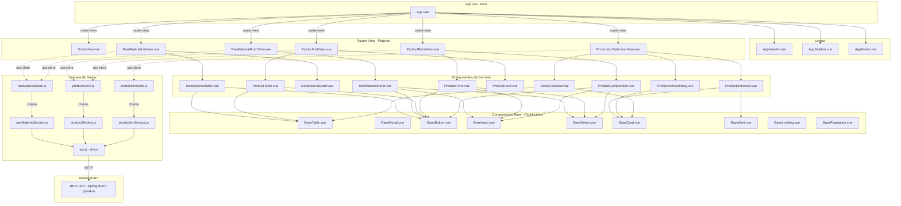

# 🏭 Frontend — Gerenciamento de Insumos e Otimização de Produção Industrial

Frontend da aplicação de gerenciamento de insumos e otimização de produção industrial, construído com **Vue.js 3** (Composition API) + **Vite**.

---

## 📋 Índice

- [Visão Geral](#-visão-geral)
- [Tecnologias Utilizadas](#-tecnologias-utilizadas)
- [Pré-requisitos](#-pré-requisitos)
- [Instalação e Execução](#-instalação-e-execução)
- [Estrutura de Pastas](#-estrutura-de-pastas)
- [Arquitetura de Componentes](#-arquitetura-de-componentes)
- [Diagrama de Componentes (Mermaid)](#-diagrama-de-componentes-mermaid)
- [Funcionalidades](#-funcionalidades)
- [Comunicação com o Backend (API)](#-comunicação-com-o-backend-api)
- [Guia de Estilização](#-guia-de-estilização)
- [Testes](#-testes)
- [Scripts Disponíveis](#-scripts-disponíveis)

---

## 🎯 Visão Geral

Esta aplicação permite que o operador de uma fábrica:

1. **Gerencie Matérias-Primas (Insumos):** cadastre, edite, liste e remova matérias-primas do estoque.
2. **Gerencie Produtos:** cadastre, edite, liste e remova produtos, definindo a composição (quais matérias-primas e quantidades são necessárias para fabricar 1 unidade).
3. **Otimize a Produção:** acesse uma tela dedicada que analisa o estoque atual e sugere quais produtos fabricar para obter o **maior valor total de venda**, resolvendo conflitos quando dois produtos disputam a mesma matéria-prima.

---

## 🛠 Tecnologias Utilizadas

| Tecnologia | Versão | Finalidade |
|---|---|---|
| **Vue.js 3** | ^3.5.29 | Framework reativo (Composition API + `<script setup>`) |
| **Vite** | ^7.3.1 | Build tool e dev server ultrarrápido |
| **Vue Router** | (a instalar) | Roteamento SPA |
| **Axios** | (a instalar) | Requisições HTTP para a API REST |
| **Pinia** | (a instalar) | Gerenciamento de estado global |
| **Vue DevTools** | ^8.0.6 | Extensão para debug em desenvolvimento |

### Dependências Recomendadas para Instalação

```bash
npm install vue-router@4 axios pinia
```

---

## ✅ Pré-requisitos

- **Node.js** `^20.19.0` ou `>=22.12.0`
- **npm** `>=10`
- **Backend** rodando na porta configurada (por padrão `http://localhost:8080`)

---

## 🚀 Instalação e Execução

```bash
# 1. Navegue até a pasta do frontend
cd frontend

# 2. Instale as dependências
npm install

# 3. Inicie o servidor de desenvolvimento
npm run dev
```

A aplicação estará disponível em `http://localhost:5173` (porta padrão do Vite).

---

## 📁 Estrutura de Pastas

A estrutura abaixo representa a organização **completa** que o frontend deve seguir, utilizando lógica de componentes reutilizáveis:

```
frontend/
├── index.html                          # Ponto de entrada HTML
├── package.json                        # Dependências e scripts
├── vite.config.js                      # Configuração do Vite
├── jsconfig.json                       # Configuração de caminhos (alias @)
│
├── public/
│   └── favicon.ico                     # Ícone da aba do navegador
│
└── src/
    ├── main.js                         # Bootstrap da aplicação Vue
    ├── App.vue                         # Componente raiz (layout + <router-view>)
    │
    ├── assets/                         # Recursos estáticos (CSS, imagens, SVG)
    │   ├── base.css                    # Variáveis CSS e reset
    │   ├── main.css                    # Estilos globais
    │   └── logo.svg                    # Logo da aplicação
    │
    ├── router/
    │   └── index.js                    # Definição de rotas (Vue Router)
    │
    ├── stores/                         # Estado global (Pinia)
    │   ├── rawMaterialStore.js         # Store de Matérias-Primas
    │   ├── productStore.js             # Store de Produtos
    │   └── productionStore.js          # Store de Otimização de Produção
    │
    ├── services/                       # Camada de comunicação com a API
    │   ├── api.js                      # Instância Axios configurada (baseURL, interceptors)
    │   ├── rawMaterialService.js       # Endpoints de Matéria-Prima
    │   ├── productService.js           # Endpoints de Produto
    │   └── productionService.js        # Endpoint de Cálculo de Produção
    │
    ├── views/                          # Páginas (uma por rota)
    │   ├── HomeView.vue                # Página inicial / Dashboard
    │   ├── RawMaterialListView.vue     # Página de listagem de Matérias-Primas
    │   ├── RawMaterialFormView.vue     # Página de cadastro/edição de Matéria-Prima
    │   ├── ProductListView.vue         # Página de listagem de Produtos
    │   ├── ProductFormView.vue         # Página de cadastro/edição de Produto
    │   └── ProductionOptimizerView.vue # Página de otimização de produção
    │
    ├── components/                     # Componentes reutilizáveis
    │   ├── layout/                     # Componentes de layout
    │   │   ├── AppHeader.vue           # Cabeçalho com navegação
    │   │   ├── AppSidebar.vue          # Menu lateral
    │   │   └── AppFooter.vue           # Rodapé
    │   │
    │   ├── common/                     # Componentes genéricos reutilizáveis
    │   │   ├── BaseTable.vue           # Tabela genérica (recebe colunas e dados via props)
    │   │   ├── BaseModal.vue           # Modal genérico (confirmação, formulários)
    │   │   ├── BaseButton.vue          # Botão padronizado
    │   │   ├── BaseInput.vue           # Input com label e validação
    │   │   ├── BaseSelect.vue          # Select com label e validação
    │   │   ├── BaseCard.vue            # Card para exibir informações
    │   │   ├── BaseAlert.vue           # Alerta de sucesso/erro/aviso
    │   │   ├── BaseLoading.vue         # Spinner / indicador de carregamento
    │   │   └── BasePagination.vue      # Paginação de listas
    │   │
    │   ├── rawMaterial/                # Componentes específicos de Matéria-Prima
    │   │   ├── RawMaterialTable.vue    # Tabela com colunas de matéria-prima
    │   │   ├── RawMaterialForm.vue     # Formulário de cadastro/edição
    │   │   └── RawMaterialCard.vue     # Card resumo de matéria-prima
    │   │
    │   ├── product/                    # Componentes específicos de Produto
    │   │   ├── ProductTable.vue        # Tabela com colunas de produto
    │   │   ├── ProductForm.vue         # Formulário de cadastro/edição
    │   │   ├── ProductCard.vue         # Card resumo de produto
    │   │   └── ProductComposition.vue  # Sub-form para adicionar matérias-primas à composição
    │   │
    │   └── production/                 # Componentes de Otimização de Produção
    │       ├── ProductionResult.vue    # Exibe resultado do cálculo de otimização
    │       ├── ProductionSummary.vue   # Resumo: total de venda, produtos sugeridos
    │       └── StockOverview.vue       # Visão geral do estoque atual
    │
    └── utils/                          # Funções utilitárias
        ├── formatters.js               # Formatação de moeda, unidades, datas
        └── validators.js               # Validações de formulários
```

---

## 🧩 Arquitetura de Componentes

O frontend segue a **lógica de componentes** do Vue.js 3, dividida em camadas:

### 1. Componentes de Layout (`components/layout/`)
Responsáveis pela estrutura visual da aplicação (header, sidebar, footer). São usados no `App.vue` e envolvem o `<router-view>`.

### 2. Componentes Genéricos / Base (`components/common/`)
Componentes **100% reutilizáveis** e sem lógica de negócio. Recebem dados via **props** e emitem eventos via **emit**. Exemplos:
- `BaseTable` — recebe `columns` e `rows` via props, emite `@edit` e `@delete`.
- `BaseModal` — recebe `title`, `visible` via props, emite `@confirm` e `@cancel`.
- `BaseInput` — recebe `label`, `modelValue`, `error` via props, emite `@update:modelValue` (v-model).

### 3. Componentes de Domínio (`components/rawMaterial/`, `components/product/`, `components/production/`)
Componentes que encapsulam lógica de negócio específica. Utilizam os componentes Base internamente:
- `RawMaterialForm` usa `BaseInput`, `BaseButton`.
- `ProductTable` usa `BaseTable` com colunas pré-definidas.
- `ProductComposition` permite adicionar/remover matérias-primas na composição do produto.

### 4. Views / Páginas (`views/`)
Cada **rota** corresponde a uma View. As Views orquestram componentes de domínio e interagem com a **Store (Pinia)** e os **Services (Axios)**. Views **não contêm lógica de UI reutilizável**.

### 5. Services (`services/`)
Camada isolada para chamadas HTTP. Cada entidade possui seu próprio arquivo de service:
```js
// services/rawMaterialService.js
import api from './api'

export default {
  getAll()        { return api.get('/raw-materials') },
  getById(id)     { return api.get(`/raw-materials/${id}`) },
  create(data)    { return api.post('/raw-materials', data) },
  update(id, data){ return api.put(`/raw-materials/${id}`, data) },
  delete(id)      { return api.delete(`/raw-materials/${id}`) },
}
```

### 6. Stores (`stores/`)
Estado global reativo com **Pinia**. Cada entidade possui sua store:
```js
// stores/rawMaterialStore.js
import { defineStore } from 'pinia'
import rawMaterialService from '@/services/rawMaterialService'

export const useRawMaterialStore = defineStore('rawMaterial', {
  state: () => ({
    items: [],
    loading: false,
    error: null,
  }),
  actions: {
    async fetchAll() { ... },
    async create(data) { ... },
    async update(id, data) { ... },
    async remove(id) { ... },
  },
})
```

---

## 📊 Diagrama de Componentes (Mermaid)



---

## ⚙️ Funcionalidades

### 📦 CRUD de Matérias-Primas
| Funcionalidade | Descrição |
|---|---|
| **Listar** | Tabela paginada com código, nome e quantidade em estoque |
| **Cadastrar** | Formulário com validação (nome obrigatório, quantidade ≥ 0) |
| **Editar** | Formulário preenchido com dados atuais, mesma validação |
| **Excluir** | Modal de confirmação antes de remover |

### 🏭 CRUD de Produtos
| Funcionalidade | Descrição |
|---|---|
| **Listar** | Tabela paginada com código, nome, valor e nº de matérias-primas |
| **Cadastrar** | Formulário com nome, valor e **composição dinâmica** (adicionar/remover matérias-primas com quantidade) |
| **Editar** | Formulário preenchido, permite alterar composição |
| **Excluir** | Modal de confirmação antes de remover |

### 📈 Otimização de Produção
| Funcionalidade | Descrição |
|---|---|
| **Visão do Estoque** | Exibe estoque atual de todas as matérias-primas |
| **Calcular Produção Ótima** | Botão que chama a API de otimização e retorna a sugestão |
| **Resultado** | Lista de produtos sugeridos com quantidade a fabricar e valor total de venda |
| **Resumo** | Card com valor total estimado de venda e matérias-primas consumidas |

---

## 🔗 Comunicação com o Backend (API)

### Instância Axios Base (`services/api.js`)

```js
import axios from 'axios'

const api = axios.create({
  baseURL: import.meta.env.VITE_API_URL || 'http://localhost:8080/api',
  headers: {
    'Content-Type': 'application/json',
  },
})

// Interceptor para tratamento global de erros
api.interceptors.response.use(
  response => response,
  error => {
    console.error('Erro na requisição:', error.response?.data || error.message)
    return Promise.reject(error)
  }
)

export default api
```

### Variável de Ambiente

Crie um arquivo `.env` na raiz do frontend:
```env
VITE_API_URL=http://localhost:8080/api
```

### Endpoints Consumidos

| Método | Endpoint | Descrição |
|---|---|---|
| `GET` | `/api/raw-materials` | Listar todas as matérias-primas |
| `GET` | `/api/raw-materials/:id` | Buscar matéria-prima por ID |
| `POST` | `/api/raw-materials` | Cadastrar matéria-prima |
| `PUT` | `/api/raw-materials/:id` | Atualizar matéria-prima |
| `DELETE` | `/api/raw-materials/:id` | Remover matéria-prima |
| `GET` | `/api/products` | Listar todos os produtos |
| `GET` | `/api/products/:id` | Buscar produto por ID |
| `POST` | `/api/products` | Cadastrar produto |
| `PUT` | `/api/products/:id` | Atualizar produto |
| `DELETE` | `/api/products/:id` | Remover produto |
| `GET` | `/api/production/optimize` | Calcular produção otimizada |

---

## 🎨 Guia de Estilização

- **Abordagem:** Scoped CSS dentro de cada componente (`<style scoped>`).
- **Variáveis globais:** definidas em `assets/base.css` (cores, fontes, espaçamentos).
- **Responsividade:** Media queries com breakpoints em `768px` e `1024px`.
- **Convenção de nomes CSS:** BEM (`block__element--modifier`) dentro dos componentes.

---

## 🧪 Testes

### Estrutura de Testes (Diferencial)

```
frontend/
└── src/
    └── __tests__/
        ├── components/
        │   ├── BaseTable.spec.js
        │   ├── BaseModal.spec.js
        │   ├── RawMaterialForm.spec.js
        │   ├── ProductForm.spec.js
        │   └── ProductComposition.spec.js
        ├── stores/
        │   ├── rawMaterialStore.spec.js
        │   └── productStore.spec.js
        └── views/
            └── ProductionOptimizerView.spec.js
```

### Instalar dependências de teste

```bash
npm install -D vitest @vue/test-utils jsdom
```

### Executar testes

```bash
npx vitest
```

---

## 📜 Scripts Disponíveis

| Comando | Descrição |
|---|---|
| `npm install` | Instala todas as dependências |
| `npm run dev` | Inicia o servidor de desenvolvimento (hot-reload) |
| `npm run build` | Compila e minifica para produção |
| `npm run preview` | Visualiza o build de produção localmente |
| `npx vitest` | Executa os testes unitários |

---

## 🗺 Rotas da Aplicação

| Rota | View | Descrição |
|---|---|---|
| `/` | `HomeView` | Dashboard inicial |
| `/raw-materials` | `RawMaterialListView` | Listagem de matérias-primas |
| `/raw-materials/new` | `RawMaterialFormView` | Cadastro de matéria-prima |
| `/raw-materials/:id/edit` | `RawMaterialFormView` | Edição de matéria-prima |
| `/products` | `ProductListView` | Listagem de produtos |
| `/products/new` | `ProductFormView` | Cadastro de produto |
| `/products/:id/edit` | `ProductFormView` | Edição de produto |
| `/production/optimize` | `ProductionOptimizerView` | Tela de otimização de produção |

---

## 🔧 Configuração do IDE

### Recomendado
- **IDE:** VS Code / IntelliJ IDEA / WebStorm
- **Extensão:** [Vue (Official)](https://marketplace.visualstudio.com/items?itemName=Vue.volar) (desabilite o Vetur)
- **Browser:** Chromium + [Vue.js DevTools](https://chromewebstore.google.com/detail/vuejs-devtools/nhdogjmejiglipccpnnnanhbledajbpd)

---

## 📄 Licença

Este projeto faz parte de um **teste prático de desenvolvimento Full Stack** para a equipe de P&D.
